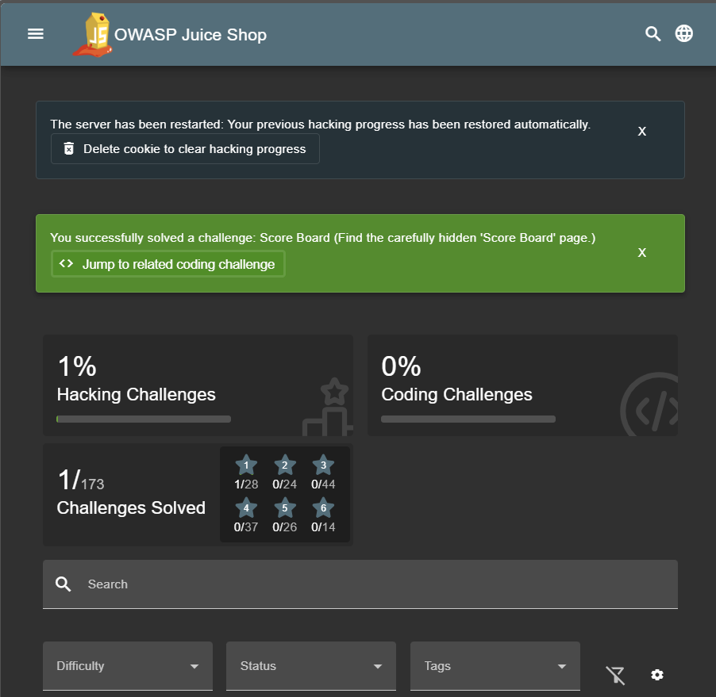

## Score Board

### Challenge: Find the carefully hidden 'Score Board' page.

1. Right Click on home page > Inspect > Sources
2. Look at `main.js`
3. Search for `path` or `score` and you would observe that there is a directory path named `score-board`
4. navigate to the url `http://localhost:3000/#/score-board` to complete this challenge

### Description

The score board page contains the scores of all the challenges. It is hidden in the source code of the home page. You can find it by inspecting the source code and looking for the directory path named `score-board`. Once you navigate to the url `http://localhost:3000/#/score-board`, you will be able to see the scores of all the challenges.
