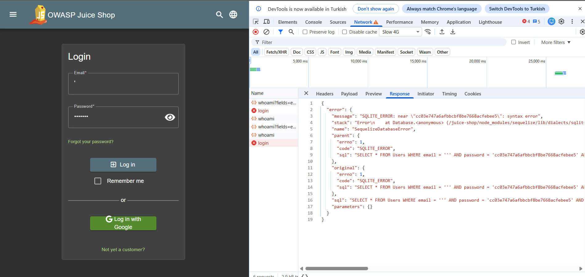
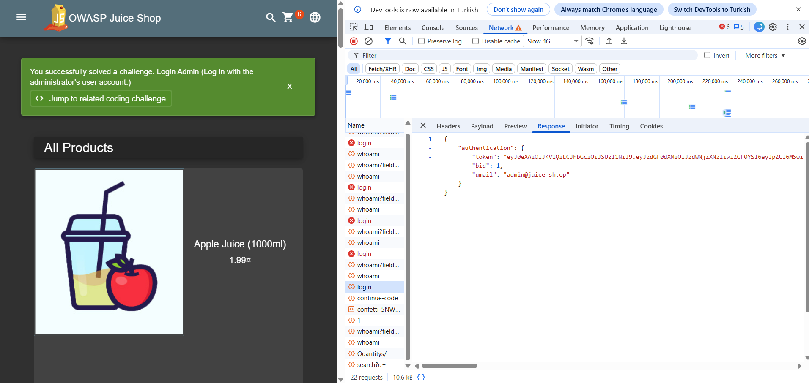

## Login Admin

### Challenge: Log in with the administrator's user account.

1. Navigate to account login
2. Submit `'` in email field and any password to observe error log with SQL query

```
"SELECT * FROM Users WHERE email = ''' AND password = 'c06db68e819be6ec3d26c6038d8e8d1f' AND deletedAt IS NULL"
```

3. Submit `' OR TRUE --` in email field and any password where `'` closes the email string and `OR TRUE --` returns boolean true and comments out the rest of the SQL query

```
"SELECT * FROM Users WHERE email = '' OR TRUE -- AND password = 'c06db68e819be6ec3d26c6038d8e8d1f' AND deletedAt IS NULL"
```

4. Observe login with first user account (happens to be admin in this case)




### Description

This challenge involves exploiting a SQL injection vulnerability in the login functionality of the OWASP Juice Shop application. By submitting specific input in the email field, you can manipulate the SQL query to bypass authentication and log in as the administrator. The first step is to submit a single quote (`'`) to observe the error log with the SQL query, which reveals how the input is being processed. Then, by submitting a crafted input such as `' OR TRUE --`, you can close the email string and use a logical operator to return true, effectively bypassing the password check and logging in as the first user account, which happens to be the admin. This highlights the importance of properly sanitizing user input and using parameterized queries to prevent SQL injection attacks.
