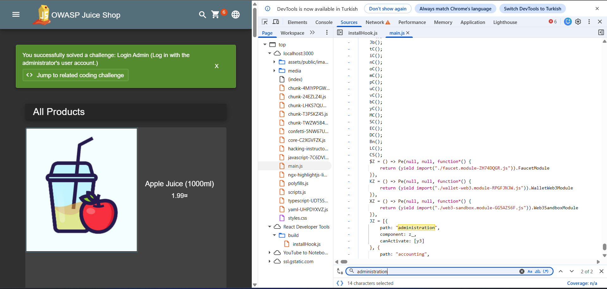
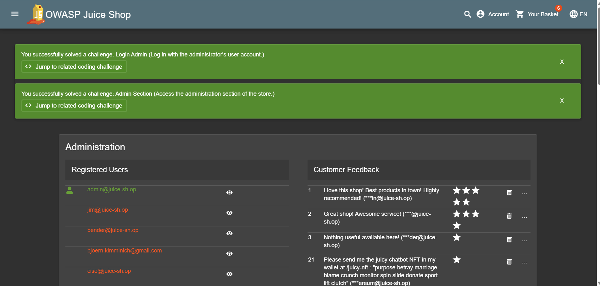

## Admin Section

### Challenge: Access the administration section of the store.

1. Open main.js in sources tab of browser inspector
2. Search for 'administrator' route with string search
3. Navigate to account login
4. Login as administrator with SQL injection or email&password combo
5. Visit http://localhost:3000/#/administration to complete this challenge

### Description

This challenge involves accessing the administration section of the OWASP Juice Shop application. The administrator route is hidden and can be discovered by inspecting the main.js file in the browser's developer tools. By searching for the 'administrator' route, you can find the URL for the admin login page. To gain access, you can use SQL injection techniques or try common email and password combinations to log in as an administrator. Once logged in, you can navigate to the administration section to complete the challenge. This highlights a security misconfiguration where sensitive routes are not properly protected, allowing unauthorized access through simple techniques.
