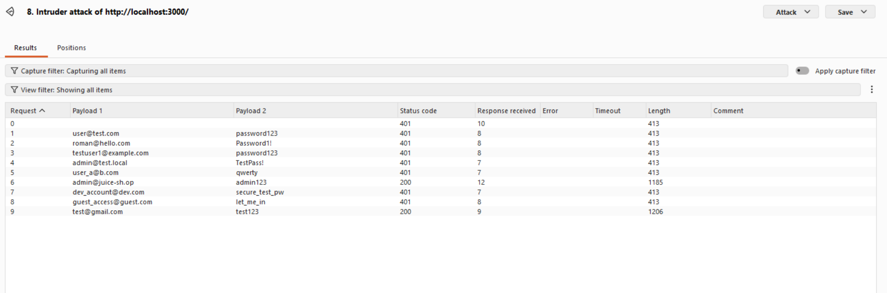
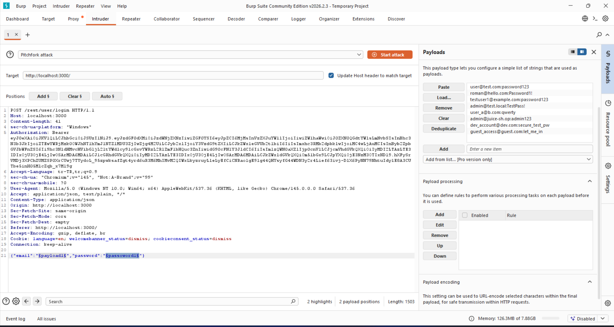

## Password Strength

### Challenge: Log in with the administrator's user credentials without previously changing them or applying SQL Injection.

1. Navigate to account login
2. Use password cracking software to login with admin credentials
   - Credentials

     `{email: admin@juice-sh.op, password: admin123}`

   - Password cracking methods
     - Brute Force
     - Dictionary
     - Rainbow Table
   - Common Passwords List

   Below is a sample weak password list that can be used in brute force / dictionary attacks. It represents common email-password combinations tried during the penetration test and is intended to demonstrate that the admin account uses an easily guessable password.

```
admin123
password
user@test.com:password123
roman@hello.com:Password1!
testuser1@example.com:password123
admin@test.local:TestPass!
user_a@b.com:qwerty
admin@juice-sh.op:admin123
dev_account@dev.com:secure_test_pw
guest_access@guest.com:let_me_in
test123@test.com:test123
```




### Description

In this challenge, the administrator's user credentials are weak and can be easily cracked using password cracking software. The password "admin123" is a common and easily guessable password, making it vulnerable to brute force attacks or dictionary attacks. By using password cracking methods, an attacker can gain unauthorized access to the administrator's account without needing to change the credentials or apply SQL Injection techniques. This highlights the importance of using strong, unique passwords to protect against unauthorized access.
