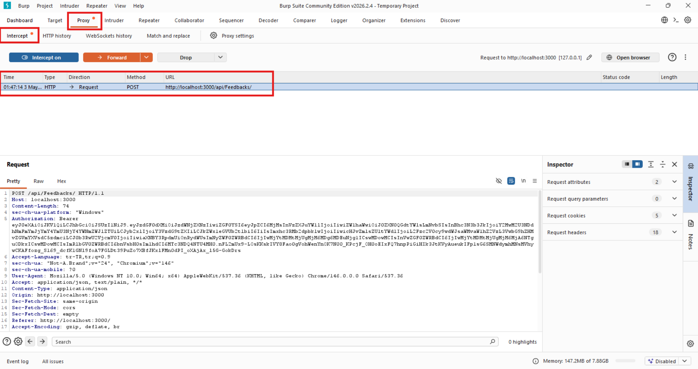
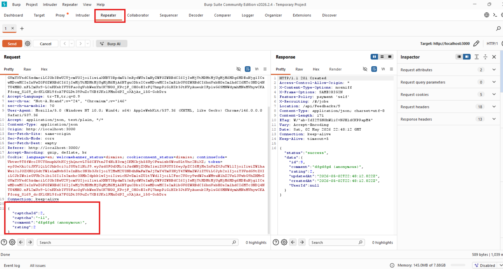

## CAPTCHA Bypass

### Challenge: Submit 10 or more customer feedbacks within 20 seconds.

1. Navigate to `http://localhost:3000/#/contact` and start intercepting the browser traffic through Burp Suite Proxy (Burp's `Intercept` is on, and the browser's proxy is set to Burp).
2. Fill in the contact form normally: write a comment, choose a star rating, solve the CAPTCHA question shown on screen (e.g., a simple math problem), and click the "Submit" button.
3. In Burp Suite > **Proxy** > **HTTP history**, capture the `POST http://localhost:3000/api/Feedbacks` request sent to the server (the line marked in red in the first screenshot).
4. In the **Body** section of the request's `Request` panel, the JSON body is visible:

- `{ "comment": "Hello", "rating": 1, "captcha": "320", "captchaId": 18 }`

   The two critical fields here are: `captchaId` (the ID of the CAPTCHA question generated by the server) and `captcha` (the user's correct answer to that question).

5. Right-click on this request and select **Send to Repeater**. In the Repeater tab, the same request is resent multiple times with `Send` **without modifying** the `captchaId` and `captcha` values (the place where these two fields are marked in red in the body in the second screenshot). Each time the server returns `HTTP/1.1 201 Created` and a JSON response containing the created feedback record — meaning the server accepts the same `captchaId`+`captcha` pair as valid every time. This proves that the CAPTCHA values are **"pinnable"** (can be fixed and reused); they should have been single-use.
6. Once verification is complete, write a 10-iteration loop using the same pinned values (e.g., 10 requests via Burp **Intruder** > Null payloads, or a small script using `curl`/Python `requests`) and send 10+ POST requests to the `/api/Feedbacks` endpoint within 20 seconds to complete the challenge.

### Description

In this challenge, the CAPTCHA mechanism can be bypassed by "pinning" (fixing and reusing) the CAPTCHA values from a previous request. When inspecting the network traffic with Burp Suite, the attacker can notice that the `captchaId` and `captcha` parameters are not marked as single-use on the server side; since the same pair is considered valid in subsequent requests, automation can be performed by repeatedly sending the same body via Repeater or a small script without having to solve a new CAPTCHA each time. This effectively renders the anti-automation protection useless and shows that CAPTCHA answers should be consumed as one-shot on the server, stored with a short TTL, and invalidated after verification.
