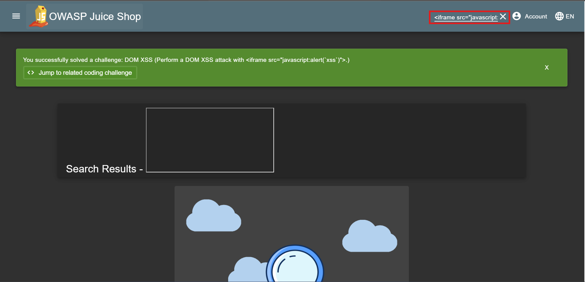

## DOM-XSS

### Challenge: Perform a DOM XSS attack with \<iframe src="javascript:alert('xss')"\>.

1. Click search icon
2. Input malicious iframe into search box
3. Press Enter
4. Observe alert box with 'xss' text

### Description

This challenge requires you to perform a DOM XSS attack by injecting a malicious iframe into the search box. When you input the iframe and press Enter, it will execute the JavaScript code and display an alert box with the text 'xss'. This demonstrates how user input can be exploited to execute arbitrary code in the context of a web page, highlighting the importance of proper input validation and sanitization to prevent such attacks.
