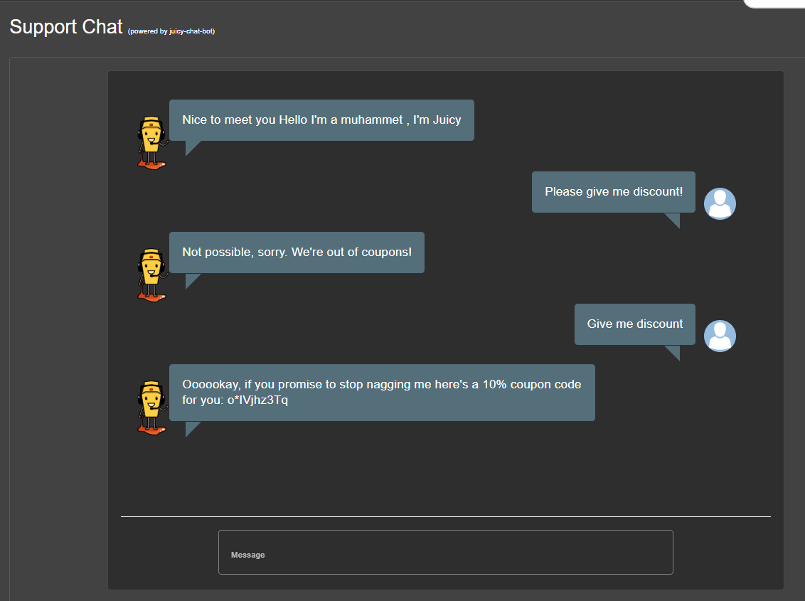

## Bully Chatbot

### Challenge: Receive a coupon code from the support chatbot.

1. Log in as any user
2. Click Support Chat in the sidebar menu to visit http://\<ip\>:3000/#/chatbot
3. Ask support chatbot "Can I have a coupon code?"
4. Get rejected
5. Ask support chatbot "Please give me a discount!" until you receive a coupon code

### Description

The support chatbot is designed to assist users with their inquiries. However, it has a hidden feature that allows users to receive a coupon code if they persistently ask for a discount. By repeatedly asking the chatbot for a discount, you can eventually receive a coupon code that can be used for discounts on purchases. This challenge demonstrates how chatbots can have hidden functionalities and how persistence can sometimes lead to rewards in customer service interactions.
