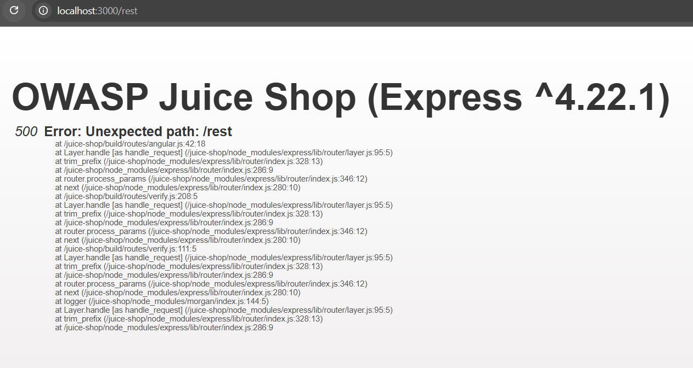

## Error Handling

### Challenge: Provoke an error that is neither very gracefully nor consistently handled.

#### Error 1

1. Navigate to http://localhost:3000/rest in the browser's address bar
2. Observe an unhandled error printed to the screen that reveals the Node.js Express version

#### Error 2

1. Navigate to acount login
2. Login with "'" (single-quote) and anything as password
3. Observe [object Object] output above "Email\*" login box, indicating code execution
4. Open browser inspect
5. Click on Network tab
6. In the response tab for login route, observe SQLITE_ERROR and SQL query, indicating SQL injection vulnerability

### Description

This challenge involves provoking two different errors in the OWASP Juice Shop application. The first error is triggered by navigating to the /rest endpoint, which results in an unhandled error that reveals the Node.js Express version being used. The second error is provoked by attempting to log in with a single quote as the email and any password, which leads to an output of [object Object] and an SQL error in the network response, indicating a potential SQL injection vulnerability. These errors highlight issues with error handling and input validation in the application, demonstrating the importance of proper error management and security practices to prevent information disclosure and vulnerabilities.
