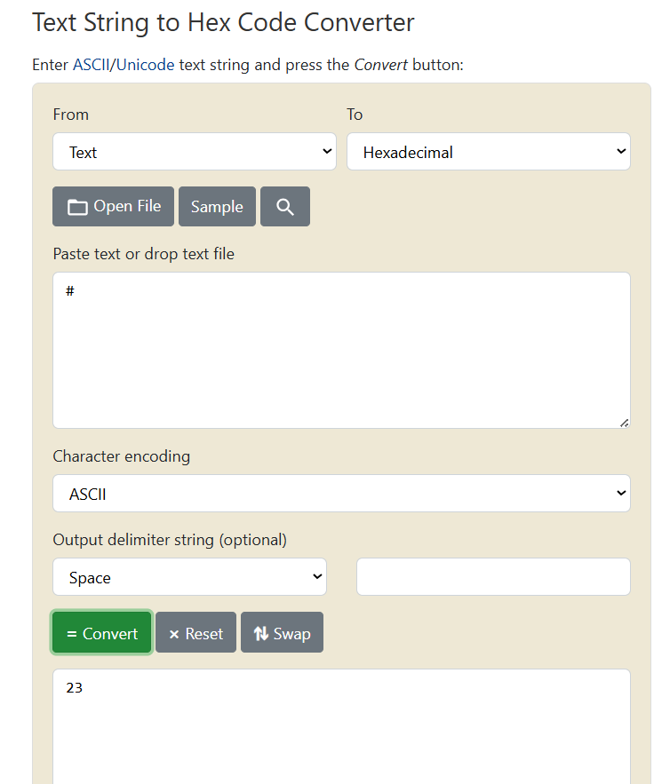

## Missing Encoding

### Challenge: Retrieve the photo of Bjoern's cat in "melee combat-mode".

1. Visit the Photo Wall
2. Inspect src to find the broken image
3. Right click on the image src to visit in new tab
4. Observe that image does not render because of '#' encoding
5. Encode '#' to '%23' in the URl to render the image onto the screen

### Description

This challenge involves retrieving a photo of Bjoern's cat that is not rendering properly due to a missing encoding in the URL. The image source contains a '#' character, which is not properly encoded, leading to a broken image. By encoding the '#' character as '%23' in the URL, you can successfully render the image and view the photo of Bjoern's cat. This challenge highlights the importance of proper URL encoding to ensure that special characters are correctly interpreted by web browsers.
