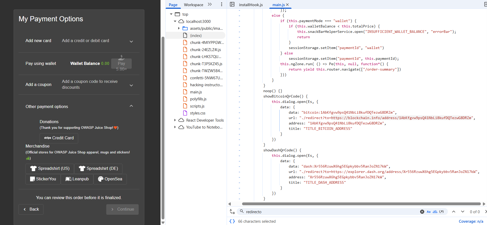

## Outdated Allowlist

### Challenge: Let us redirect you to one of our crypto currency addresses which are not promoted any longer.

1. Log in to the application as any user
2. Order some items
3. Click on "Your Basket"
4. Checkout your items
5. Add a new address if you have to
6. Click "Continue"
7. Select a delivery speed
8. Click "Continue"
9. On the "My Payment Options" screen, click "Other payment options" toggle
10. Observe the "redirect?to=" variable when hovering over the Merchandise links
11. Open the browser inspector
12. Inspect sources to open main.js
13. Ctrl-F to find "redirect?to=" variable
14. Observe addresses of crypto wallets
15. Visit one of the crypto wallets to complete the challenge

### Description

This challenge involves exploiting an outdated allowlist for cryptocurrency addresses in the OWASP Juice Shop application. By navigating through the checkout process and inspecting the "Other payment options" toggle, you can find a variable that contains links to cryptocurrency wallets. These links are not promoted anymore, but they are still present in the code. By visiting one of these crypto wallet addresses, you can complete the challenge. This highlights the importance of regularly updating and maintaining allowlists to prevent unvalidated redirects and potential security risks associated with outdated information.
