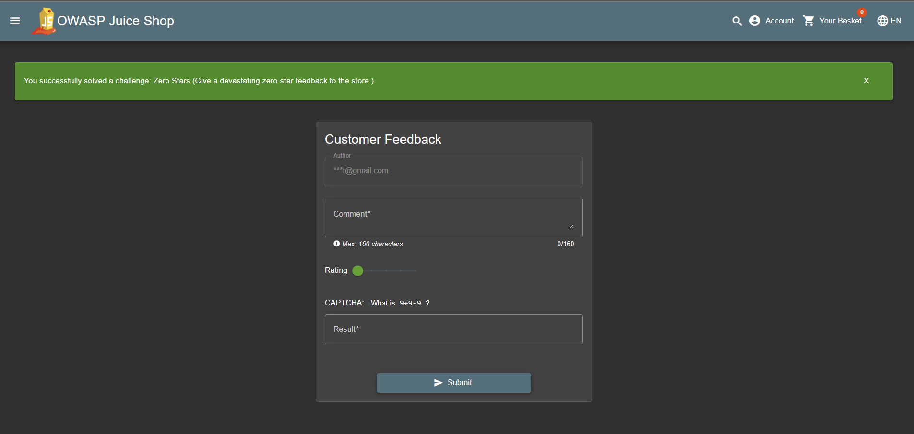

## Zero Stars

### Challenge: Give a devastating zero-star feedback to the store.

1. Navigate to Customer Feedback
2. Write a comment
3. DO NOT TOGGLE THE RATING SLIDER
4. Solve the captcha
5. Open the HTML inspector
6. Find the Submit button
7. Remove class `mat-mdc-button-disabled`
8. Remove HTML attributes `mat-ripple-loader-disabled` and `disabled`
9. Click the enabled submit button to complete this challenge

### Description

This challenge involves giving a devastating zero-star feedback to the OWASP Juice Shop store. The challenge requires you to navigate to the Customer Feedback section, write a comment, and then manipulate the HTML elements to enable the submit button without toggling the rating slider. By removing specific classes and attributes from the submit button, you can bypass the validation that prevents submitting feedback without a rating. This highlights the importance of proper input validation and ensuring that user interactions are correctly handled to prevent unintended actions or feedback submissions.
